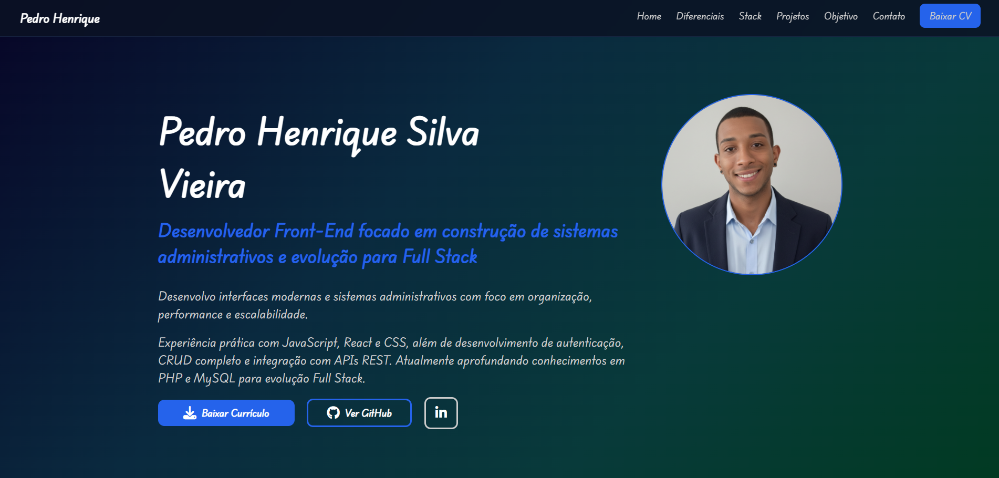

<h1 align="center">Pedro Henrique • Portfolio</h1>

  Portfolio desenvolvido com foco estratégico em recrutadores, Tech Leads e RHs no LinkedIn.

---

## 🎥 Preview

https://pedro-henrique-dev-portfolio.vercel.app/

## 📌 Sobre o Projeto

Este é meu terceiro portfólio, desenvolvido com o objetivo de apresentar minha evolução técnica e posicionamento profissional de forma clara e estratégica.

O projeto foi construído utilizando **HTML5, CSS3 e JavaScript puro**, com foco em:

- Estrutura semântica
- Responsividade completa
- Performance
- Organização de código
- Experiência do usuário (UX)

A proposta é demonstrar não apenas estética, mas também organização, lógica e atenção a detalhes técnicos.

---

## 🚀 Tecnologias Utilizadas
- HTML5
- CSS3
- JavaScript (Vanilla JS)
- AOS js
---

## 🎯 Objetivo

Este portfólio foi desenvolvido com foco específico em:

- Recrutadores
- Tech Leads
- Tech Recruiters
- Profissionais de RH da área de tecnologia

Apresentando:

- Projetos práticos
- Evolução técnica
- Organização de código
- Estrutura profissional

---

## 💻 Diferenciais Técnicos

- Layout responsivo para todos os dispositivos
- Navegação fluida
- Estrutura organizada
- Código limpo e comentado
- Boas práticas de front-end

---

## 📈 Evolução

Sou desenvolvedor com base sólida em Front-End e atualmente estou aprofundando meus estudos em Back-End (PHP, MySQL e arquitetura MVC), buscando atuar como Desenvolvedor Full Stack.

Este projeto representa mais um passo nessa evolução.

---

## 📬 Contato

LinkedIn: https://www.linkedin.com/in/pedro-henrique-39148b2a1/
Email: dev.pedrohenrique.contato@gmail.com  

---

  Desenvolvido por Pedro Henrique

